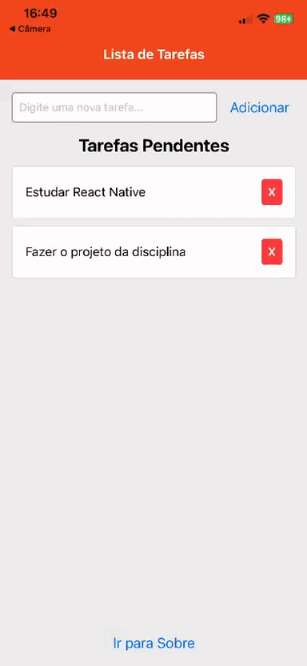

# ✅ Projeto Lista de Tarefas (React Native com TypeScript)


Este é um aplicativo mobile de lista de tarefas (To-Do List) desenvolvido como parte de um projeto de estudo. O objetivo principal foi aplicar conceitos fundamentais do desenvolvimento com React Native, incluindo **gerenciamento de estado local com Hooks** e **navegação entre telas** utilizando React Navigation [4, 5].

O projeto foi construído do zero com o template `blank-typescript` do Expo, garantindo um código mais seguro e robusto.

---

### (Demonstração)



---

### ✨ Funcionalidades Principais

O aplicativo implementa os seguintes recursos:

- **Adicionar Tarefas:** Um formulário com campo de texto (`TextInput`) permite ao usuário inserir novas tarefas [5].
- **Listar Tarefas:** As tarefas são exibidas em uma lista vertical utilizando o componente `FlatList`.
- **Remover Tarefas:** Cada item da lista possui um botão para exclusão, atualizando o estado da UI em tempo real.
- **Navegação em Pilha (Stack):** Utiliza o `createNativeStackNavigator` para gerenciar a navegação entre 3 telas:
  - **Home (Lista de Tarefas):** Tela principal onde as tarefas são gerenciadas.
  - **Detalhes:** Tela que exibe as informações de uma tarefa específica.
  - **Sobre:** Uma terceira tela com informações sobre o aplicativo.
- **Passagem de Parâmetros:** Ao clicar em uma tarefa, seus dados (como ID e texto) são passados para a tela de Detalhes [4, 6].
- **Validação de Formulário:** Validação básica que impede a adição de tarefas com texto vazio.
- **Feedback ao Usuário:** Utiliza o componente `Alert` nativo para notificar o usuário sobre erros (ex: campo vazio).

---

### 🛠️ Tecnologias Utilizadas

Este projeto foi construído utilizando as seguintes tecnologias e bibliotecas:

- **[React Native](https://reactnative.dev/)**: Framework para desenvolvimento de aplicativos móveis multiplataforma.
- **[Expo](https://expo.dev/)**: Plataforma e conjunto de ferramentas para facilitar o desenvolvimento e build de apps React Native [3].
- **[TypeScript](https://www.typescriptlang.org/)**: Superset do JavaScript que adiciona tipagem estática ao código.
- **[React Navigation](https://reactnavigation.org/)**: Biblioteca para roteamento e navegação no aplicativo [4].
- **Hooks do React**: `useState` para gerenciamento de estado local dos componentes [5].

---

### 🚀 Como Executar o Projeto

Para executar este projeto localmente, siga os passos abaixo.

**Pré-requisitos:**

- [Node.js](https://nodejs.org/en/) (versão LTS recomendada)
- [Git](https://git-scm.com/)
- O aplicativo **Expo Go** instalado no seu smartphone (Android/iOS).

**Passos:**

1.  **Clone o repositório:**

    ```bash
    git clone https://github.com/seu-usuario/seu-repositorio.git
    ```

2.  **Acesse a pasta do projeto:**

    ```bash
    cd seu-repositorio
    ```

3.  **Instale as dependências:**

    ```bash
    npm install
    ```

4.  **Inicie o servidor de desenvolvimento Expo:**

    ```bash
    npx expo start
    ```

5.  **Teste no seu dispositivo:**
    Após o comando anterior, um QR Code será exibido no terminal. Abra o aplicativo **Expo Go** no seu celular e escaneie o QR Code para carregar o projeto [3].

---

### 📂 Estrutura de Pastas

O projeto segue uma estrutura de pastas organizada para separar as responsabilidades, conforme sugerido nas boas práticas [4]:

meu-app-typescript/ ├── src/ │ └── screens/ # Contém todas as telas do aplicativo │ ├── HomeScreen.tsx │ ├── DetailsScreen.tsx │ └── SettingsScreen.tsx ├── App.tsx # Ponto de entrada e configuração da navegação ├── package.json └── tsconfig.json

---

_Desenvolvido com base no material de aula e exemplos práticos de gerenciamento de estado e navegação._
